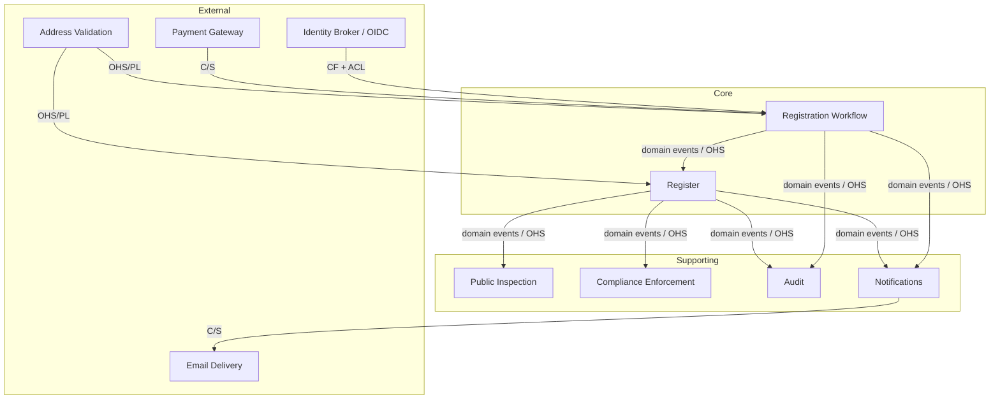
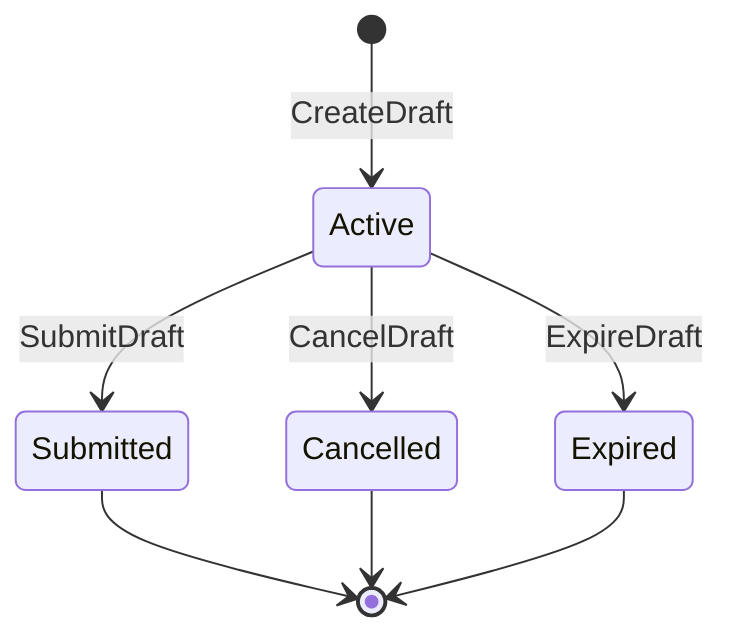
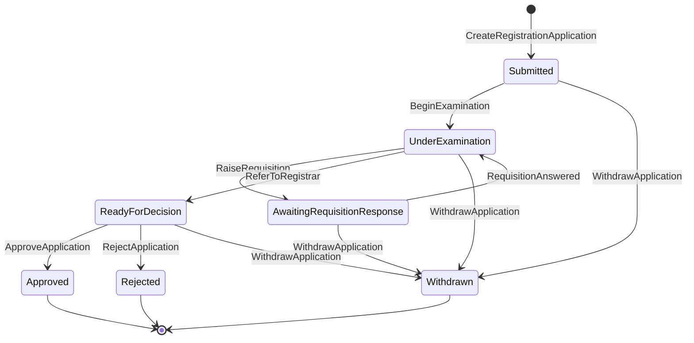
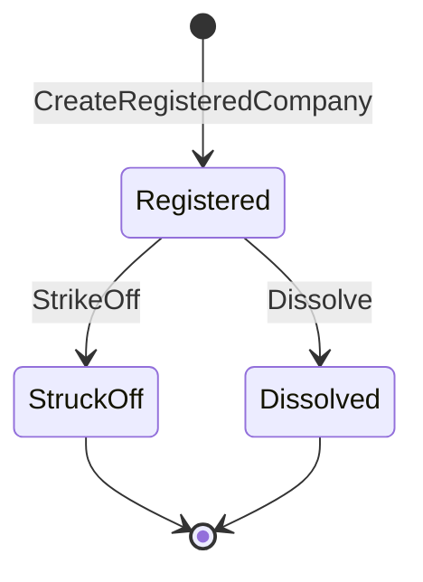

# Domain Discovery

*Status: In review.*
*Date: 2026-05-26.*

This document is the output of domain discovery for the companies registry
system. It establishes the shared language, boundaries, and model that all
other documents - the Act, business rules, user stories, ADRs, and code -
must remain consistent with.

Domain discovery happens before implementation because the boundaries and
language established here are the hardest and most expensive things to change
later. A wrong aggregate boundary costs weeks; a wrong table name costs
minutes.

## The Domain

**Domain:** National Companies Registry

The companies registry is the institutional mechanism by which the State
grants legal existence to companies, maintains the authoritative record of
those companies, and enforces their ongoing obligations under the Act.

This is not a CRUD application. It is a legal fact-recording system. The
central tension in the domain is between two concerns that must be kept
deliberately separate:

- **The process of registration** - transient, workflow-driven, produces a
  legal decision.
- **The Register itself** - permanent, append-only, the authoritative record
  of legal facts that the process produced.

Conflating these two concerns is the most common modelling mistake in registry
systems. A company does not exist because an application was approved. It
exists because `RegisteredCompanyCreated` was recorded in the Register. These
are causally linked but legally and structurally distinct facts.

## Subdomains

| Subdomain | Type | Description |
|-----------|------|-------------|
| **Registration Workflow** | Core | The process by which a draft becomes a registration application, is examined, decided on, and - if approved - triggers the creation of a registered company. This is where the Registry's institutional competence lives. |
| **The Register** | Core | The authoritative, permanent, append-only record of registered companies and their ongoing particulars. The source of truth for legal existence. |
| **Compliance Enforcement** | Supporting | Annual returns, director/address notifications, strike-off, and voluntary dissolution. Keeps the Register accurate after registration. |
| **Public Register Inspection** | Supporting | Public-facing search and lookup. An eventually-consistent read projection of the Register, open to all without authentication. |
| **Audit** | Supporting | Human-readable, append-only audit log of all significant Registry decisions. Serves external auditors. Derived from domain events. |
| **Identity** | Generic | Authentication via OIDC identity broker; verified-person records for directors and officers. Consumed by the Registry; not performed by it. |
| **Payment** | Generic | Collection of the statutory filing fee. Boundary with an external payment gateway (e.g. Stripe). |
| **Notifications** | Generic | Delivery of notifications to applicants, examiners, and registrars at state transition points. |
| **Address Validation** | Generic | External service that verifies a proposed registered office address is plausible, valid, within the jurisdiction, and usable for service of legal notices. |

**Core subdomains** represent the Registry's institutional purpose - they are
the reason the organisation exists and the place where modelling mistakes
have legal consequences. Invest the most design effort here.

**Supporting subdomains** are necessary but not the reason the Registry
exists. They can be simplified or deferred without undermining the core.

**Generic subdomains** are commodity concerns. They should be bought,
wrapped, or replaced - not built from scratch.

## Ubiquitous Language

The ubiquitous language is the single shared vocabulary used in the Act, the
business rules, the user stories, the tests, and the code. When a term has
a legal definition in the Act, that definition is authoritative and must not
be overloaded, narrowed, or replaced by a technical synonym.

### Legal Terms (defined in the Act, §1)

| Term | Definition |
|------|------------|
| **Applicant** | An identity-verified natural person who creates a draft or submits a registration application |
| **Authorised Officer** | A director of a registered company, or a natural person duly authorised in writing by the directors, to act on the company's behalf for the purposes of the Act. Initial Authorised Officers are the directors named in the approved registration application |
| **Draft** | A preliminary record created by an Applicant in the Registry system to prepare a registration application. Has no legal existence. Confers no rights or obligations |
| **Registration Application** | A formal lodgement made by an Applicant upon submission of a completed draft. A legal act |
| **Registered Company** | A company that has been registered under the Act, assigned a Registration Number, and entered in the Register. A legal entity |
| **Registrar** | The officer of the Registry appointed to decide on registration applications and to maintain the Register |
| **Examiner** | An officer of the Registry appointed to examine registration applications and prepare cases for decision by the Registrar |
| **Registry** | The national companies registry established under the Act |
| **Register** | The authoritative record of all registered companies, maintained by the Registry under the Act |
| **Registration Number** | The unique, permanent identifier assigned to a registered company upon registration. Never reused |
| **Registered Office Address** | An address within the jurisdiction at which legal notices may be served on the company |
| **Requisition** | A formal written request raised by an Examiner during examination, requiring the Applicant to provide clarification or additional information |
| **Identity-Verified Natural Person** | A natural person for whom the Registry holds a verified identity flag or record from a trusted identity provider or Registry verification service |

### Technical Terms (defined by the architecture)

| Term | Definition |
|------|------------|
| **Command** | An expression of intent from a user or system actor. Commands may be accepted or rejected. Named in imperative PascalCase: `SubmitDraft`, `ApproveApplication` |
| **Event** | A fact that has already happened and is permanently recorded. Events are never altered or deleted. Named in past-tense PascalCase: `DraftSubmitted`, `RegisteredCompanyCreated` |
| **Decider** | A pure function `(state, command) → (events | error)` that enforces the FSM and business rules for one aggregate. Takes no I/O |
| **Evolve** | A pure function `(state, event) → state` that applies a single event to an aggregate's state |
| **Fold** | Reducing a sequence of events to the current state by applying `evolve` repeatedly from the initial state |
| **Aggregate** | The unit of consistency for a group of related domain objects. Commands are always addressed to one aggregate. Events are always scoped to one aggregate stream |
| **Event Store** | The append-only database of all domain events, keyed by aggregate stream. The authoritative write-side record. The Register is the subset of event streams containing `RegisteredCompanyCreated` |
| **Projector** | A component that consumes events from the event store and writes to a read model. Projectors are idempotent and rebuildable |
| **Read Model** | A derived, queryable representation of domain state built by a Projector from events. Disposable and rebuildable. Not authoritative |
| **Command Ledger** | A record of commands already processed, keyed by command ID. Enforces idempotency. If a command ID is seen again, the recorded outcome is returned without re-processing |
| **Process Manager** | A stateful component that reacts to events and issues subsequent commands to coordinate workflows that span multiple aggregates. Persists its own state for recovery |
| **Transactional Outbox** | A table written atomically with domain events. An outbox publisher reads it and publishes to external message brokers at-least-once. Decouples event persistence from external publication |
| **Finite State Machine (FSM)** | An explicit EDN map of `[from-state command] → to-state` transitions for an aggregate. The authoritative source of which commands are valid in which states |
| **Fitness Function** | An automated test that verifies an architectural characteristic continuously. Runs in CI and fails the build if the characteristic is violated |
| **Port** | An interface definition that the domain requires from infrastructure. Implemented by an Adaptor |
| **Adaptor** | A concrete implementation of a Port for a specific technology. Swappable without changing domain logic |
| **Audit Log** | A separate, human-readable, append-only store of significant Registry decisions. Written via the outbox. Serves external auditors. Contains full-fidelity data with no masking; access is extremely restricted |
| **Application Log** | Structured operational log output emitted by the Registry system at runtime, used by infrastructure and DevOps teams to diagnose behaviour and incidents. Contains masked values for any field classified Restricted or above; access is moderately restricted |
| **Data Classification** | A label assigned to every data field and document type indicating its permitted disclosure level. The four levels are: **Public** (open to all under the Act), **Restricted** (internal Registry staff only), **Confidential** (named roles only; sensitive personal data and identity documents), **Sealed** (court order or regulatory hold; authorised officers and auditors only) |
| **Masking** | The replacement of a field value with a classification marker (e.g. `[RESTRICTED]`, `[CONFIDENTIAL]`) in application logs to prevent accidental disclosure of sensitive data in operational tooling. Masking applies only to application logs; the audit log always records full-fidelity values |
| **Four-Eyes Rule** | The legal requirement under §13A that the natural person who examines a registration application must not be the same natural person who approves or rejects it. Enforced as an ABAC check comparing the `verified_person_id` of the assigned Examiner against that of the acting Registrar at decision time. A breach is invalid and of no legal effect |

## Bounded Contexts

### Registration Workflow

**Owns:** Draft aggregate, RegistrationApplication aggregate, all examination
and decision commands and events.

**Responsibility:** Manage the lifecycle from a draft to a Registrar decision.
Enforce submission validation (BR-SB-*), examination rules (BR-RQ-*, BR-RA-*),
and approval rules (BR-AP-*). Issue `CreateRegisteredCompany` via the Approval
Process Manager when an application is approved.

**Produces:** `DraftSubmitted`, `RegistrationApplicationCreated`,
`ExaminationStarted`, `RequisitionRaised`, `ApplicationReferredToRegistrar`,
`RegistrationApplicationApproved`, `RegistrationApplicationRejected`,
`RegistrationApplicationWithdrawn`.

**Consumes from Identity:** Verified-person claims for Applicants and proposed
directors. Translated at the boundary via an Anticorruption Layer.

**Consumes from Payment:** Filing fee payment confirmation before creating the
Registration Application.

### Register

**Owns:** RegisteredCompany aggregate, post-registration obligation commands
and events.

**Responsibility:** Record the legal existence of registered companies
(`RegisteredCompanyCreated`), maintain their current particulars (directors,
address, status), and enforce post-registration obligations (annual returns,
director/address notifications). The event streams in this context, filtered
to those containing `RegisteredCompanyCreated`, **are** the Register.

**Produces:** `RegisteredCompanyCreated`, `DirectorChanged`,
`RegisteredOfficeChanged`, `AnnualReturnFiled`, `CompanyStruckOff`,
`CompanyDissolved`, `AuthorisedOfficerRecorded`, `AuthorisedOfficerRevoked`.

**Consumes from Registration Workflow:** `RegistrationApplicationApproved`
(via the Approval Process Manager) to trigger `CreateRegisteredCompany`.

### Public Inspection

**Owns:** Register read model (the `register` table and related projections).

**Responsibility:** Serve public search by company name, Registration Number,
and director name. No authentication required. Eventually consistent.

**Does not own:** The legal truth of company existence. It reflects the
Register; it does not define it. A company exists because of events in the
Register context, not because a row exists in this read model.

**Consumes from Register:** Domain events from `RegisteredCompany` streams,
projected by the Register Projector.

### Compliance Enforcement

**Owns:** Strike-off and dissolution workflows, annual return tracking,
overdue notification scheduling.

**Responsibility:** Monitor registered companies for compliance with their
obligations. Trigger follow-up actions when deadlines pass. Support the
Registrar's strike-off and voluntary dissolution decisions.

**Consumes from Register:** `AnnualReturnFiled`, `DirectorChanged`,
`RegisteredOfficeChanged`, `RegisteredCompanyCreated` to establish obligations.

### Identity

**Owns:** Verified-person records, OIDC session management.

**Responsibility:** Authenticate Registry users via the trusted OIDC identity
broker. Maintain verified identity flags and records for natural persons.

**Upstream of:** Registration Workflow and Register (they conform to identity
claims; they do not influence how identity is verified).

This context is largely external. The Registry consumes it via an
Anticorruption Layer that translates OIDC claims and verified-person records
into the Registry's own identity vocabulary.

### Payment

**Owns:** Filing fee collection. Boundary with the external payment gateway.

**Responsibility:** Accept payment for the filing fee as part of the
SubmitDraft flow. Return a payment confirmation or failure. Issue refunds only
in the system-failure exception path (BR-FE-006).

**This context is a boundary, not an internal domain.** The payment gateway
(e.g. Stripe) is external. The Registry instructs it; it does not control it.

### Notifications

**Owns:** Notification delivery to applicants, examiners, and registrars.

**Responsibility:** Deliver the right notification to the right actor at each
state transition. Idempotent: never send a duplicate notification for the same
event. Records sent notifications for deduplication.

**Consumes from:** Registration Workflow and Register events via the internal
event bus and outbox.

### Audit

**Owns:** The audit log store.

**Responsibility:** Receive all significant domain events via the outbox,
transform them into human-readable audit records, and store them permanently.
Supports external auditor queries without requiring knowledge of event sourcing.

**Consumes from:** All contexts via the transactional outbox (ADR-0005,
ADR-0018).

## Context Map

The context map shows the integration relationships between bounded contexts.
Arrows point from upstream to downstream. Integration pattern labels:

- **ACL** - Anticorruption Layer: downstream translates upstream model
- **OHS/PL** - Open Host Service / Published Language: upstream provides a
  stable published protocol
- **C/S** - Customer/Supplier: downstream is the customer; upstream adapts to
  downstream needs within negotiated limits
- **CF** - Conformist: downstream adopts upstream model with no influence

**Integration notes:**

| Upstream | Downstream | Pattern | Notes |
|----------|------------|---------|-------|
| Identity Broker | Registration Workflow | CF + ACL | Registry conforms to OIDC claims; ACL translates them to Registry identity vocabulary |
| Payment Gateway | Registration Workflow | C/S | Registry instructs payment; gateway is an external supplier |
| Address Validation | Registration Workflow, Register | OHS/PL | External service with a stable API; Registry adapts to it |
| Registration Workflow | Register | OHS/PL | Registration publishes domain events; Register consumes them via the Approval Process Manager |
| Register | Public Inspection | OHS/PL | Public Inspection is a read projection of Register events; no write path |
| Register | Compliance | OHS/PL | Compliance tracks obligations from Register events |
| All core contexts | Audit | OHS/PL | All events flow to Audit via the transactional outbox |
| All core contexts | Notifications | OHS/PL | Notification triggers come from domain events |
| Notifications | Email Delivery | C/S | Registry instructs email delivery; provider is an external supplier |

## Aggregates

| Aggregate | Context | Identity | States | Invariants |
|-----------|---------|----------|--------|------------|
| **Draft** | Registration Workflow | `draft-id` (UUID) | `Active`, `Submitted`, `Cancelled`, `Expired` | Applicant may not hold > 5 active drafts; terminal states are irreversible; only the owning Applicant may cancel |
| **RegistrationApplication** | Registration Workflow | `application-id` (UUID) | `Submitted`, `UnderExamination`, `AwaitingRequisitionResponse`, `ReadyForDecision`, `Approved`, `Rejected`, `Withdrawn` | One assigned Examiner only; approval/rejection only from `ReadyForDecision`; no open requisitions at referral; Applicant may only withdraw their own |
| **RegisteredCompany** | Register | `registration-number` (Registry-assigned, permanent) | `Registered`, `StruckOff`, `Dissolved` | Registration Number never reused; must have ≥ 2 current directors; only the Registrar may strike off or dissolve; director/office changes are events not state transitions |

The authoritative EDN transition specs are in [`07-business-rules.md`](07-business-rules.md).
The diagrams below are renderings of those specs.

### Draft FSM

### Registration Application FSM

### Registered Company FSM

*Note: Director changes, address changes, and annual returns are recorded as
events on the `RegisteredCompany` stream but do not change its top-level state.*

## Commands

Commands are named in imperative form. Each command is addressed to exactly
one aggregate. A command is either accepted (produces events) or rejected
(produces an error). Commands carry a stable `command-id` for idempotency.

### Draft Commands

| Command | Issued By | From State | To State |
|---------|-----------|------------|----------|
| `CreateDraft` | Applicant | - | `Active` |
| `UpdateDraft` | Applicant | `Active` | `Active` |
| `SubmitDraft` | Applicant (via submission flow) | `Active` | `Submitted` |
| `CancelDraft` | Applicant | `Active` | `Cancelled` |
| `ExpireDraft` | System scheduler | `Active` | `Expired` |

### Registration Application Commands

| Command | Issued By | From State | To State |
|---------|-----------|------------|----------|
| `CreateRegistrationApplication` | Submission Process Manager | - | `Submitted` |
| `BeginExamination` | Examiner | `Submitted` | `UnderExamination` |
| `RaiseRequisition` | Examiner (assigned) | `UnderExamination` or `AwaitingRequisitionResponse` | `AwaitingRequisitionResponse` |
| `CloseRequisition` | Examiner (assigned, raised in error) | `AwaitingRequisitionResponse` | `UnderExamination` (if no remaining open) |
| `RespondToRequisition` | Applicant | `AwaitingRequisitionResponse` | `UnderExamination` (if last open) / stays |
| `RecordMissedDeadlineNextAction` | Examiner (assigned) | `AwaitingRequisitionResponse` | Stays (deadline extended or proceeds toward referral) |
| `ReferToRegistrar` | Examiner (assigned) | `UnderExamination` | `ReadyForDecision` |
| `ApproveApplication` | Registrar | `ReadyForDecision` | `Approved` |
| `RejectApplication` | Registrar | `ReadyForDecision` | `Rejected` |
| `WithdrawApplication` | Applicant | `Submitted`, `UnderExamination`, `AwaitingRequisitionResponse`, `ReadyForDecision` | `Withdrawn` |

### Registered Company Commands

| Command | Issued By | From State | Notes |
|---------|-----------|------------|-------|
| `CreateRegisteredCompany` | Approval Process Manager | - | Issues after `RegistrationApplicationApproved` |
| `NotifyDirectorChange` | Authorised Officer | `Registered` | Does not change top-level state |
| `NotifyAddressChange` | Authorised Officer | `Registered` | Does not change top-level state |
| `FileAnnualReturn` | Authorised Officer | `Registered` | Does not change top-level state |
| `ApplyForDissolution` | Authorised Officer | `Registered` | Initiates Registrar review |
| `StrikeOff` | Registrar | `Registered` | `→ StruckOff` |
| `Dissolve` | Registrar | `Registered` | `→ Dissolved` |

## Events

Events are named in past-tense form. Every event carries: `event-id`,
`event-type`, `event-causation-id` (the command that caused it),
`event-correlation-id` (the originating request chain), `occurred-at`,
and `actor-id`.

### Draft Events

| Event | Produced By | Legal Significance |
|-------|-------------|-------------------|
| `DraftCreated` | `CreateDraft` | Establishes the workspace; sets the expiry clock |
| `DraftUpdated` | `UpdateDraft` | Records changes to draft contents |
| `DraftSubmitted` | `SubmitDraft` | Draft becomes immutable; triggers Submission Process Manager |
| `DraftCancelled` | `CancelDraft` | Terminal; permanently recorded |
| `DraftExpired` | `ExpireDraft` | Terminal; permanently recorded |

### Registration Application Events

| Event | Produced By | Legal Significance |
|-------|-------------|-------------------|
| `RegistrationApplicationCreated` | `CreateRegistrationApplication` | The application is a legal act from this moment (§12) |
| `ExaminationStarted` | `BeginExamination` | Application assigned to Examiner; removed from queue |
| `RequisitionRaised` | `RaiseRequisition` | Formal request to Applicant; deadline set |
| `RequisitionClosed` | `CloseRequisition` | Requisition raised in error; permanently recorded |
| `RequisitionAnswered` | `RespondToRequisition` | Response permanently recorded |
| `MissedDeadlineNextActionRecorded` | `RecordMissedDeadlineNextAction` | Examiner decision on missed deadline; permanently recorded |
| `ApplicationReferredToRegistrar` | `ReferToRegistrar` | Application ready for decision |
| `RegistrationApplicationApproved` | `ApproveApplication` | Registrar's decision; triggers Approval Process Manager |
| `RegistrationApplicationRejected` | `RejectApplication` | Terminal; rejection reason permanently recorded |
| `RegistrationApplicationWithdrawn` | `WithdrawApplication` | Terminal; filing fee non-refundable |

### Registered Company Events

| Event | Produced By | Legal Significance |
|-------|-------------|-------------------|
| `RegisteredCompanyCreated` | `CreateRegisteredCompany` | **The legal existence fact.** A company is a legal entity from this moment (§15). This event in the event store *is* the entry in the Register |
| `AuthorisedOfficerRecorded` | `CreateRegisteredCompany` (initial directors) | Each approved director becomes an Authorised Officer on registration (BR-AO-001) |
| `DirectorChanged` | `NotifyDirectorChange` | Permanently recorded change to company particulars |
| `AuthorisedOfficerRecorded` / `AuthorisedOfficerRevoked` | `NotifyDirectorChange` | Director add/remove triggers AO status change |
| `RegisteredOfficeChanged` | `NotifyAddressChange` | Permanently recorded change to registered address |
| `AnnualReturnFiled` | `FileAnnualReturn` | Compliance obligation discharged for the return period |
| `CompanyStruckOff` | `StrikeOff` | Company ceases to be a legal entity (§23); Registration Number never reused |
| `CompanyDissolved` | `Dissolve` | Company ceases to be a legal entity (§24); Registration Number never reused |

### Process Managers

Process managers are not aggregates. They coordinate workflows by reacting to
events and issuing subsequent commands.

| Process Manager | Trigger Event | Commands Issued |
|-----------------|---------------|-----------------|
| **Submission Process Manager** | `DraftSubmitted` | Instructs payment; on success issues `CreateRegistrationApplication` |
| **Approval Process Manager** | `RegistrationApplicationApproved` | Issues `CreateRegisteredCompany`; on success triggers registration notification |
