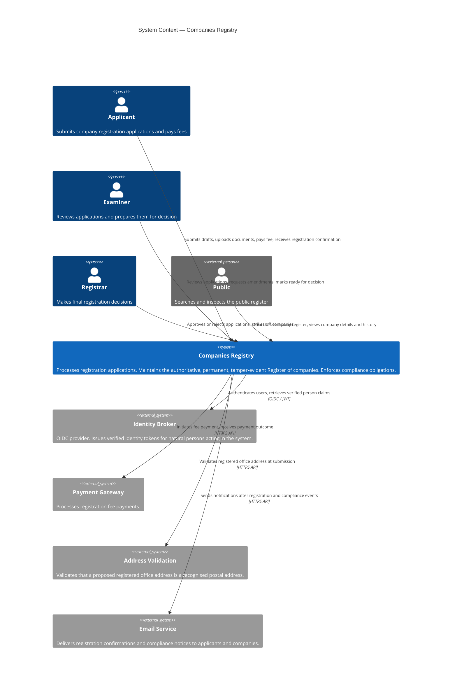
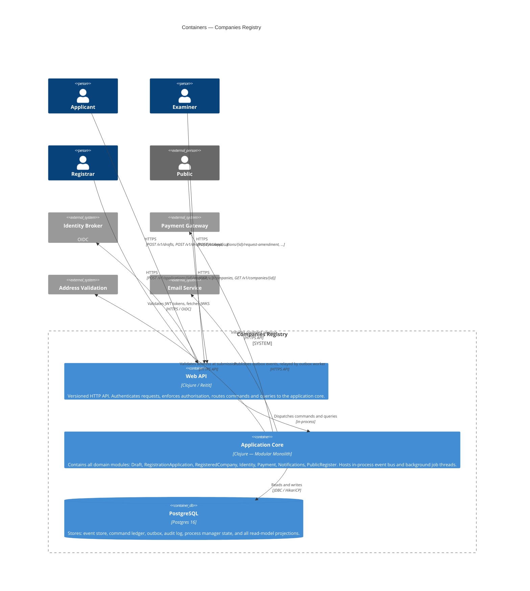
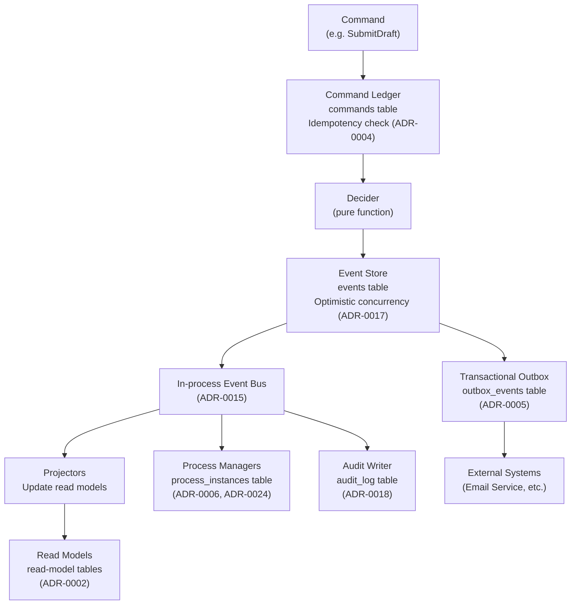
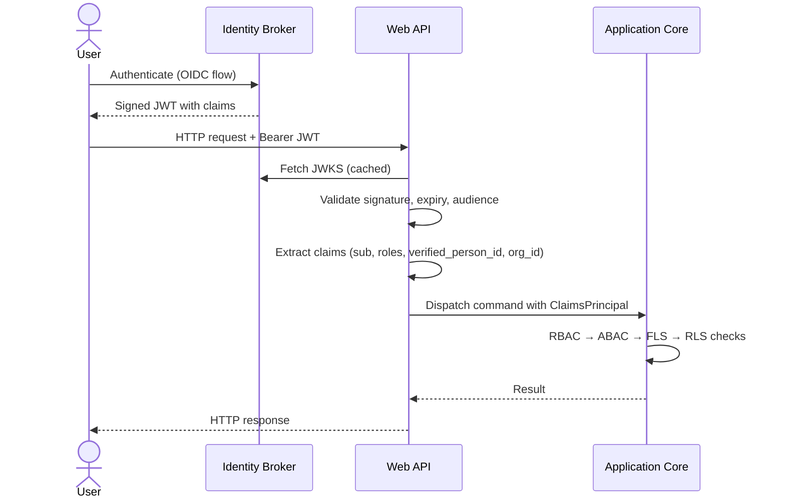
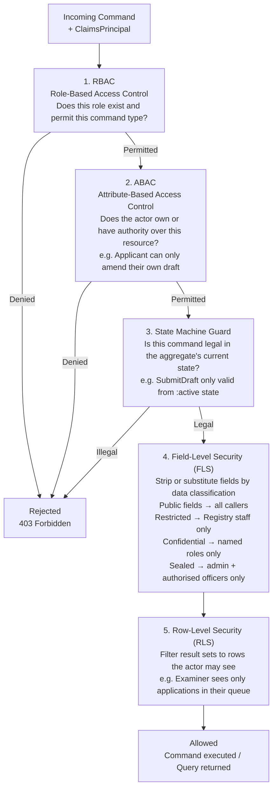

# Architecture

*Status: Accepted.*
*Date: 2026-05-26.*

This document describes the system structure at four levels of abstraction:
system context, containers, data, and security. All structural decisions
referenced here are recorded in [`adrs/`](adrs/README.md). Diagrams are
maintained as Mermaid source so they render in GitHub and most editors without
external tooling.

---

## C4 Level 1 — System Context

*Who uses the system, and what external systems does it depend on?*



### Key Relationships

| Relationship | Nature |
|---|---|
| Registry ← Identity Broker | The Registry consumes verified identity outcomes; it does not perform identity proofing. (ADR-0007) |
| Registry ← Payment Gateway | Payment is part of the submission boundary; the gateway integration is outside the Registry contract. (ADR-0008) |
| Registry → Address Validation | Address is validated at draft submission, not at approval. The Registry records the validation outcome as a fact. |
| Registry → Email Service | Notifications are published via the transactional outbox after domain events. The Registry does not call the email service directly from command handlers. (ADR-0005) |

---

## C4 Level 2 — Containers

*What are the deployable units, and how do they communicate?*

The Registry is a single deployable modular monolith (ADR-0012). There is no
separate message broker — the event bus is in-process (ADR-0015). External
publication uses the transactional outbox pattern (ADR-0005), relayed by a
background thread (ADR-0013).



### Module Responsibilities

| Module | Bounded Context | Owns |
|--------|----------------|------|
| Draft | Draft | Draft aggregate; CreateDraft, AmendDraft, SubmitDraft, CancelDraft commands |
| RegistrationApplication | RegistrationApplication | Application aggregate; examination and decision workflow; Submission and Approval process managers |
| RegisteredCompany | RegisteredCompany | RegisteredCompany aggregate; director/address changes; strike-off and dissolution |
| Identity | Identity | Verified person records consumed from Identity Broker; person lookup |
| Payment | Payment boundary | Payment initiation and outcome recording; fee schedule |
| Notifications | Notifications | Notification read model; renders and dispatches email via outbox |
| PublicRegister | PublicRegister | Public-facing read model; company search and detail queries |

### Internal Communication

Commands and queries cross module boundaries only through defined ports
(ADR-0019). Modules do not call each other's internal functions. Domain events
published on the in-process bus are the only coupling between modules at
runtime (ADR-0015).

---

## Data Architecture

*How is data stored and how does it flow from the write side to the read side?*



### Schema Definitions

#### Event Store

The authoritative Register. Events are never updated or deleted (ADR-0001).

```sql
CREATE TABLE events (
    id              UUID        PRIMARY KEY,
    stream_id       UUID        NOT NULL,           -- aggregate instance ID
    stream_type     TEXT        NOT NULL,           -- "draft" | "registration-application" | "registered-company"
    position        BIGINT      NOT NULL,           -- sequence within this stream
    global_position BIGSERIAL,                      -- global ordering for projectors
    event_type      TEXT        NOT NULL,           -- e.g. "draft-submitted.v1"
    payload         JSONB       NOT NULL,
    metadata        JSONB       NOT NULL,           -- actor_id, causation_id, correlation_id, occurred_at
    UNIQUE (stream_id, position)
);
```

`position` is the optimistic concurrency token: an append with
`expected-position = N` fails if the stream has already reached position `N`
(ADR-0017). `global_position` is a monotonic sequence used by projectors to
track replay progress.

#### Command Ledger

Records every command processed. Enables idempotency: a command whose
`command_id` already exists returns the previously recorded outcome without
re-executing (ADR-0004).

```sql
CREATE TABLE commands (
    command_id      UUID        PRIMARY KEY,
    command_type    TEXT        NOT NULL,
    payload         JSONB       NOT NULL,
    outcome         JSONB,                         -- recorded result; NULL until processed
    actor_id        UUID        NOT NULL,
    correlation_id  UUID        NOT NULL,
    received_at     TIMESTAMPTZ NOT NULL,
    processed_at    TIMESTAMPTZ
);
```

#### Transactional Outbox

Events to be published to external systems are written in the same transaction
as the domain events. A background worker relays them (ADR-0005).

```sql
CREATE TABLE outbox_events (
    id              BIGSERIAL   PRIMARY KEY,
    event_id        UUID        NOT NULL REFERENCES events(id),
    topic           TEXT        NOT NULL,          -- routing key for the target system
    payload         JSONB       NOT NULL,
    created_at      TIMESTAMPTZ NOT NULL,
    published_at    TIMESTAMPTZ                    -- NULL until relayed
);
```

#### Audit Log

A separate, human-readable record of every Registry decision. Written by an
audit writer subscribing to the in-process bus, relayed via the outbox to
ensure it survives crashes (ADR-0018). Designed for external auditors who
should not need to understand event sourcing.

```sql
CREATE TABLE audit_log (
    id              BIGSERIAL   PRIMARY KEY,
    actor_id        UUID        NOT NULL,
    actor_role      TEXT        NOT NULL,          -- "examiner" | "registrar" | "applicant" | "system"
    action          TEXT        NOT NULL,          -- e.g. "approved-registration-application"
    target_type     TEXT        NOT NULL,          -- "registration-application" | "registered-company"
    target_id       UUID        NOT NULL,
    description     TEXT        NOT NULL,          -- human-readable prose for auditors
    causation_id    UUID        NOT NULL,          -- traces back to the originating command
    correlation_id  UUID        NOT NULL,
    occurred_at     TIMESTAMPTZ NOT NULL
);
```

#### Process Manager State

Persists the state of in-flight workflow instances so they survive crashes and
restarts (ADR-0024).

```sql
CREATE TABLE process_instances (
    id              UUID        PRIMARY KEY,       -- stable across restarts
    process_type    TEXT        NOT NULL,          -- "submission" | "approval"
    current_step    TEXT        NOT NULL,
    inputs          JSONB       NOT NULL,          -- events received so far
    commands_issued JSONB       NOT NULL,          -- commands already dispatched (for idempotency)
    outcomes        JSONB       NOT NULL,          -- recorded results of issued commands
    started_at      TIMESTAMPTZ NOT NULL,
    updated_at      TIMESTAMPTZ NOT NULL,
    completed_at    TIMESTAMPTZ
);
```

#### Read Models

Read models are disposable projections rebuilt from the event store (ADR-0002,
ADR-0023). They are never the source of truth.

| Table | Purpose | Updated By |
|-------|---------|-----------|
| `company_register` | Public-facing register search and detail | PublicRegister projector |
| `application_queue` | Examiner and Registrar work queue | RegistrationApplication projector |
| `draft_view` | Applicant's in-progress draft | Draft projector |
| `company_particulars` | Full company details including director history | RegisteredCompany projector |
| `notification_queue` | Pending outbound notifications | Notifications projector |

### Write-to-Read Data Flow

```
Command received
  → Idempotency check against command ledger
  → Decider loads event stream (events table)
  → Decider produces new events
  → Append events + write outbox + record command outcome (single transaction)
  → In-process bus delivers events to:
      • Projectors → update read model tables
      • Process managers → update process_instances, dispatch next commands
      • Audit writer → insert into audit_log
  → Outbox worker (background thread) relays to external systems
```

---

## Security Architecture

*How are actors authenticated, authorised, and audited?*

### Claims Flow

Every request to the Web API must carry a signed JWT issued by the Identity
Broker. The API validates the token signature against the broker's JWKS
endpoint, extracts the claims, and attaches them to the request context. No
session state is held server-side.



### JWT Claim Structure

| Claim | Type | Description |
|-------|------|-------------|
| `sub` | UUID | Unique identifier for the authenticated user |
| `roles` | `[]string` | Registry roles: `applicant`, `examiner`, `registrar`, `admin` |
| `verified_person_id` | UUID | ID of the verified person record in the Identity context |
| `org_id` | UUID | Organisation the user is acting on behalf of (applicants only) |
| `email` | string | Delivery address for notifications |

### Authorisation Layers

Authorisation is applied in sequence (ADR-0020). A request must pass all
applicable layers.



FLS is driven by classification metadata annotated on response schemas (ADR-0025).
The full field-by-field classification table is in [`07-business-rules.md`](07-business-rules.md)
under Group 14 (BR-DC-*).

#### RBAC — Role Permissions

| Command / Query | applicant | examiner | registrar | admin | system |
|---|---|---|---|---|---|
| CreateDraft, AmendDraft, SubmitDraft, CancelDraft | own only | — | — | — | — |
| RequestAmendment, MarkReadyForDecision | — | ✓ | — | — | — |
| ApproveApplication, RejectApplication | — | — | ✓ | — | — |
| StrikeOffCompany, DissolveCompany | — | — | ✓ | — | — |
| GET /v1/companies (public register) | ✓ | ✓ | ✓ | ✓ | — |
| GET /v1/companies/{id}/audit-log | — | — | — | ✓ | — |

#### ABAC — Ownership Rules

| Resource | Rule |
|----------|------|
| Draft | Only the `org_id` that created the draft may amend or cancel it |
| RegistrationApplication | Only the examiner assigned to an application may mark it ready for decision |
| RegistrationApplication | **Four-Eyes Rule (§13A):** The `verified_person_id` of the acting Registrar must not match the `verified_person_id` of the assigned Examiner on the same application. Checked at `ApproveApplication` and `RejectApplication`. Breach is rejected with reason `four-eyes-violation` and recorded in the audit log (BR-4E-001–BR-4E-004) |
| RegisteredCompany | Only a director with an active `verified_person_id` linked to the company may file changes |

### Data Classification and Log Controls

Data classification (ADR-0025) governs what each surface is permitted to reveal:

| Surface | Masking | Access |
|---------|---------|--------|
| Public API endpoints | FLS strips Restricted and above; only Public fields returned to unauthenticated callers | Open (unauthenticated) |
| Internal API endpoints | FLS strips fields above the caller's permitted classification level | Authenticated Registry staff |
| Application logs | Fields classified Restricted, Confidential, or Sealed replaced with `[RESTRICTED]`, `[CONFIDENTIAL]`, `[SEALED]` at log emission | Moderately restricted — operations/DevOps personnel only, controlled by log aggregation platform |
| Audit log | No masking — full fidelity required as the legal record | Extremely restricted — `admin` role and external auditors via `audit_reader` DB role only; no API endpoint exposes audit log rows |

#### Database Role Separation for Log Access

```
registry_app   — INSERT/SELECT/UPDATE on events, commands, outbox, read models, process_instances
                 INSERT on audit_log   (write-only; cannot read back)
                 No access to audit_log SELECT

audit_writer   — INSERT-only on audit_log (used by audit writer component)

audit_reader   — SELECT-only on audit_log (used by external auditors via direct DB session)
```

This means a compromised application process cannot read or modify audit log
rows, and cannot expose them through any API endpoint.

### Audit Trail as a Security Control

Every command execution — whether accepted or rejected — produces an audit log
entry containing the actor identity, role, action taken, target resource,
human-readable description, and timestamp. Entries are immutable. The audit log
is written transactionally with domain events and cannot be bypassed.

Auditors connect to the database directly using the `audit_reader` credential
and inspect `audit_log` rows without needing to understand the event store
schema (ADR-0018). Audit log entries contain full-fidelity values with no
masking.

### Transport Security

| Boundary | Control |
|----------|---------|
| Client → Web API | TLS 1.2+ enforced; HTTP Strict Transport Security header |
| Web API → Identity Broker | TLS; JWKS cache with short TTL; JWT audience claim validated |
| Web API → Payment Gateway | TLS; API key held in environment secret, not in code or config files |
| Web API → Address Validation | TLS; API key from environment |
| Application → Database | TLS; credentials from environment; least-privilege DB role per concern |
| Outbox Worker → Email Service | TLS; API key from environment |

### Secrets Management

No secrets are stored in code or committed configuration files. All credentials
(database password, payment gateway API key, email API key) are injected as
environment variables at runtime. In production this is satisfied by the
container orchestration platform's secret store (ADR-0014, ADR-0009 deferred).
